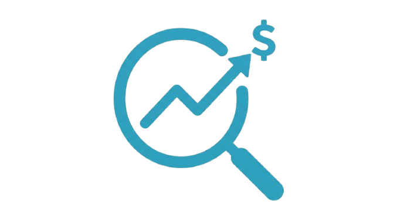
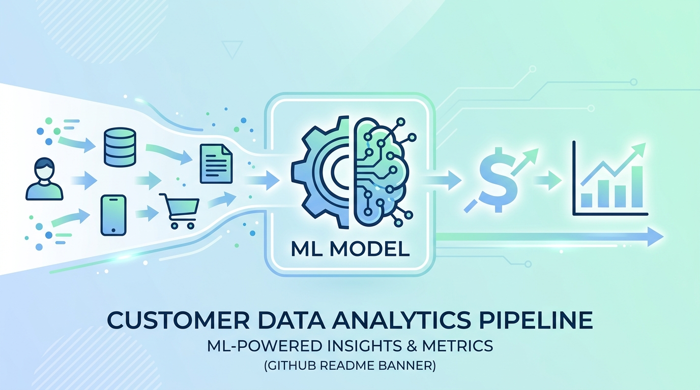

#  Gradient boosting - Lead & Income Predictor




A machine learning project that predicts monthly **Leads**, **Sum Income**, and **Sum Scrub Cost** for partner/offer combinations, based on historical performance data. Includes a full model comparison across seven algorithms and a deployed Streamlit app for interactive predictions.

🔗 **Live app:** [Click here](https://ml-lead-income-cost-prediction-hgwny2t4lvp64uzfhamhmr.streamlit.app/)
---

## What this project does

Given a **Partner**, **Offer**, **Sum Cost** (budget), **Month**, and **Year**, the model predicts:

- Expected number of Leads
- Expected Sum Income
- Expected Sum Scrub Cost (cost of leads that fail quality screening)

The goal is to help forecast expected performance before committing spend to a partner/offer combination, replacing gut-estimate budgeting with a data-backed forecast.

---

## How the model was built

Seven different modeling approaches were tested and evaluated using both cross-validation and a held-out test set, to ensure results were genuinely reliable rather than the product of a lucky train/test split:

| Model | CV R² | CV Std | Result |
|---|---|---|---|
| Linear Regression | 0.833 | 0.044 | Baseline |
| Lasso Regression | 0.829 | 0.046 | No improvement over baseline |
| Decision Tree | 0.876 | 0.023 | Improved, but leakage risk found and fixed |
| XGBoost | 0.856 | 0.035 | Unstable across hyperparameter runs — rejected |
| Random Forest | 0.886 | 0.033 | Strong and stable |
| **Gradient Boosting** | **0.911** | **0.017** | **✅ Selected — best accuracy and consistency** |
| Stacking Ensemble | 0.907 | 0.021 | Did not outperform Gradient Boosting alone |

**Gradient Boosting** was selected as the final production model, achieving the highest cross-validated R² (91.1%) with the tightest, most consistent performance across data folds.

Full reasoning, per-model diagnostics, and interpretation are documented directly in the notebook (`Lead_Prediction.ipynb`).

---

## Project structure

```
lead_prediction/
├── Lead_Prediction.ipynb      # Full analysis: EDA, cleaning, model comparison
├── anonymized_data.csv        # Training data (partner/offer names anonymized)
├── app.py                     # Streamlit prediction app
├── requirements.txt           # Pinned Python package versions
├── runtime.txt                # Python version for deployment
├── gbm_pipeline.pkl           # Trained production model
├── known_partners.pkl         # List of partners seen during training
├── known_offers.pkl           # List of offers seen during training
└── README.md
```

---

## Running the notebook yourself

### 1. Download the project

Clone the repo, or download it as a ZIP from GitHub (**Code → Download ZIP**) and unzip it wherever you'd like on your computer.

```bash
git clone <your-repo-url>
cd lead_prediction
```

### 2. Update the data path

The notebook loads data using a path defined near the top of the file:

```python
CONSTRUCTION_DATA = "/Users/sanjib700/Desktop/My_Projects/1800/Data"
```

**Change this line to match where the data file lives on your computer.** For example, if you cloned this repo to your Desktop, it might look like:

```python
CONSTRUCTION_DATA = "/Users/yourname/Desktop/lead_prediction"
```

> 💡 Tip: run this in a notebook cell to confirm your current working directory, which is often the easiest path to use:
> ```python
> import os
> print(os.getcwd())
> ```

### 3. Install required packages

```bash
pip install -r requirements.txt
```

Or, if running the notebook directly without the Streamlit app:

```bash
pip install pandas numpy scikit-learn xgboost matplotlib seaborn joblib
```

### 4. Run the notebook

Open `Lead_Prediction.ipynb` in Jupyter and run cells from top to bottom (**Kernel → Restart & Run All** recommended, to avoid stale variable issues from out-of-order execution).

---

## Running the Streamlit app locally

```bash
pip install -r requirements.txt
streamlit run app.py
```

This launches the interactive prediction tool in your browser, where you can select a Partner, Offer, Sum Cost, Month, and Year to get a forecast.

---

## Model performance (final model — Gradient Boosting)

| Target | R² | MAE |
|---|---|---|
| Leads | 0.950 | ±16.90 |
| Sum Income | 0.796 | ±$131.78 |
| Sum Scrub Cost | 0.979 | ±$6.40 |

> R² and MAE reflect overall model performance on historical holdout data, not certainty about any individual prediction. Predictions are estimates intended to support — not replace — business judgment.

---

## Key findings and limitations

- **`Sum Cost` is the dominant driver** across all three predicted targets — spend level explains most of the variation in outcomes.
- **`Sum Income` is consistently the hardest target to predict** across every model tested, likely because it depends on lead *quality* and conversion behavior, which are not captured in the available features.
- **One partner (`Partner_59`) showed unusually strong, consistent influence** on Leads predictions across multiple independent models — confirmed as a genuine pattern in the data, not a modeling artifact.
- **Predictions for partner/offer combinations with very few historical records, or spend levels far outside the historical range, should be treated with low confidence** — the model does not extrapolate reliably beyond the range of data it was trained on.

---

## Data privacy note

Partner and Offer names in this dataset have been anonymized prior to publication. The underlying numeric performance data (leads, cost, revenue, income) reflects real historical business activity.

---

## Tech stack

- **Python** 3.13
- **pandas / numpy** — data processing
- **scikit-learn** — modeling, pipelines, cross-validation
- **xgboost** — gradient boosting comparison
- **matplotlib / seaborn** — visualization
- **Streamlit** — interactive web app
- **joblib** — model persistence

---


**Sanjib Samadder**

**📬 Let's connect!** I'm open to discussions about data science, machine learning, and collaborative projects.

[](mailto:skilled.sanjib@gmail.com)
[](https://github.com/sanjibSamadder)
[](https://linkedin.com/in/sanjib-samadder)

**Happy Predicting!** 📊

